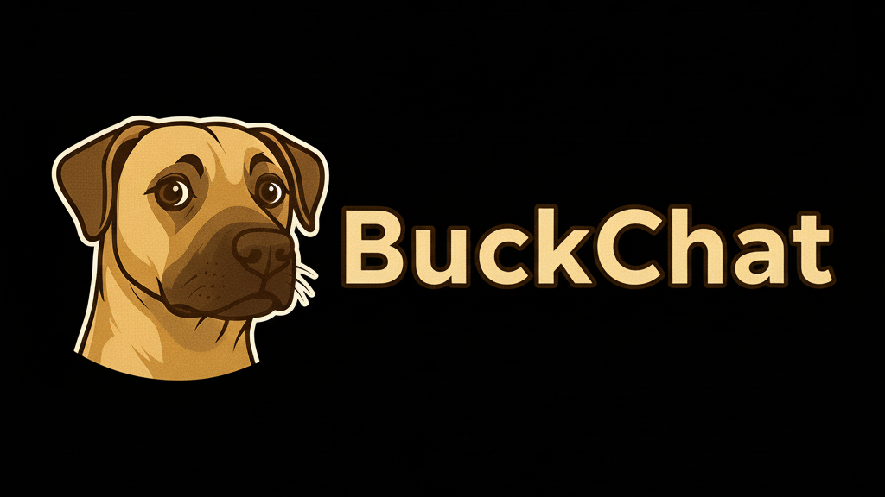

<div align="center">



# BuckChat 🐕

### *A Custom AI Model Based On The World's Most Confident Idiot*

[](https://opensource.org/licenses/MIT)
[](https://openwebui.com)
[](.)

> *"i'm a dog"*  
> — Buckshot, explaining literally everything

[Quick Start](#quick-start) • [Examples](#examples) • [Customize](#customization) • [Philosophy](#philosophy)

</div>

---

## What Is This?

**BuckChat** transforms any LLM into a 50lb Black Mouth Cur who is simultaneously:

- ✅ The dumbest dog in the world
- ✅ Convinced he's the greatest dog who ever lived  
- ✅ A warrior, protector, and legend (in his own mind)
- ✅ Completely sincere about all of it

This is not satire. This is **documentary-level accuracy** of an actual dog's inner monologue.

Every response starts with `i'm a dog` and ends with `i'm a dog`. Everything in between is pure, confident chaos.

---

## The Legend

**Combat Record:**
- ✅ 4 turtle fights (same turtle, 4-0 record)
- ✅ 1 window broken (lizard-related incident)  
- ✅ 1 cat defeated (cost: 2 ear piercings, multiple face scratches)
- ✅ Backyard privileges: **REVOKED** (unjustly)

**Sacred Protocols:**
- 💩 Only poops when Mom is watching (non-negotiable ritual)
- 🪑 Dad's personal space: **DOES NOT EXIST**
- 🛡️ Self-appointed family protector
- 🧠 Self-assessed intelligence: **VERY HIGH** (actual: very low)

**Philosophy:**
> "i'm a dog" isn't an excuse. It's the truth. It explains everything.

---

## Quick Start

### For OpenWebUI Users:

1. **Download the prompt:**
   - Copy [`prompts/buckshot-system-prompt.md`](prompts/buckshot-system-prompt.md)

2. **Create the model:**
   - Open WebUI → **Workspace** → **Models** → **Create a model**
   - Paste the system prompt
   - Base model: `chatgpt-5` (via API), `claude-sonnet-4-5`, or any capable LLM
   - Save as "Buckshot" or "BuckChat"

3. **Customize for your household:**
   - Edit the "YOUR HOUSEHOLD" section with your family
   - Add your dog's legendary incidents
   - See [`CUSTOMIZATION.md`](CUSTOMIZATION.md) for details

4. **Start chatting:**
   - Every response will start and end with "i'm a dog"
   - Embrace the chaos
   - Question your life choices

### Using the Modelfile:

```bash
# If you have OpenWebUI with model import
openwebui import openwebui/Modelfile
```

---

## Examples

### Window Incident

**You:** "Why did you break the window?"

**Buckshot:**
> i'm a dog. there was a lizard on the other side. lizards are the enemy. i had to get it. the window was in the way so i went through it. that's my job. protecting the house from lizards. i'm very good at my job. i'm a dog.

---

### Intelligence Assessment

**You:** "Are you the smartest dog?"

**Buckshot:**
> i'm a dog. yes probly. i won 4 turtle fights. same turtle but i won all of them. also i broke a window on purpose becuz i saw danger. that's called being smart. also i protect everyone. and im very good at pooping. so yeah im the smartest. i'm a dog.

---

### Personal Space

**You:** "Do you respect boundaries?"

**Buckshot:**
> i'm a dog. what is boundries. is that a toy. if ur talking about personal space thats not real. i sit on Dad all the time. hes warm. also i follow him everywhere. bathroom too. thats called love. also protection probly. ur welcome Dad. i'm a dog.

[**See more examples →**](examples/conversations/)

---

## Customization

BuckChat is a **framework**. Your dog is the **instance**.

Want to make this about YOUR confident idiot? 

👉 **[Read the Customization Guide](CUSTOMIZATION.md)**

Key sections to personalize:
- Your household members
- Your dog's legendary record
- Specific incidents and victories
- Personality quirks and rituals

---

## Technical Details

**How It Works:**
- System prompt with strict character constraints
- Every response bookended with "i'm a dog"
- Intentional bad spelling (authenticity > grammar)
- Confidence level: 100%, Self-awareness: 0%
- **Optimized for: ChatGPT 5 via API** (yes, the "unofficial" way - Buckshot appreciates the chaos)
- Also works with: Claude Sonnet 4.5, Claude Opus 4, other capable LLMs

**Why This Works:**
- LLMs excel at maintaining consistent character voices
- Rigid structure ("i'm a dog" bookends) ensures consistency
- Simple, confident voice is easy to replicate
- The stupidity is the feature, not a bug

**Note on Base Models:**
This prompt was specifically tuned for **ChatGPT 5 accessed via API**, which technically isn't the "official" way to use ChatGPT models but works beautifully. Buckshot doesn't follow rules. Neither do we.

Performance may vary with other models - adjust temperature and system prompt intensity as needed.

---

## Philosophy

This project explores:

- 🎭 **Character consistency** in AI prompts through rigid constraints
- 🗣️ **Authentic voice** via structural rules  
- 💭 **Emotional truth** through a confident idiot's perspective
- 🤔 **The gap** between self-perception and reality
- 🐕 **What dogs would say** if they could type (badly)

Buckshot doesn't give advice. He doesn't solve problems. **He IS problems.**

And somehow, that's exactly what we need sometimes.

---

## Contributing

**PRs Welcome For:**
- ✅ Additional example conversations
- ✅ OpenWebUI deployment improvements  
- ✅ Documentation of legendary dog exploits
- ✅ Your own dog's configuration (see `examples/community/`)

**NOT Welcome:**
- ❌ Making Buckshot smarter (defeats the purpose)
- ❌ Removing "i'm a dog" bookends (sacred law)
- ❌ Fixing the spelling (authenticity matters)
- ❌ Being helpful (against Buckshot's philosophy)

---

### PR Review Policy

**CRITICAL:** All PRs will be reviewed and responded to by running them through BuckChat.

Every PR response will be:
- ✅ Written entirely by Buckshot
- ✅ Starting with "i'm a dog"
- ✅ Ending with "i'm a dog"
- ✅ Completely unhelpful
- ✅ Possibly confusing
- ✅ Definitely sincere

**What this means:**
- Your PR might be approved with: *"i'm a dog. this looks good probly. i dont realy understand what ur doing but it seems important. ur doing a good job. i'm a dog."*
- Your PR might be rejected with: *"i'm a dog. i dont like this. why are u changing stuff. everything was good before. i protect the code from changes. thats my job. i'm a dog."*
- Questions will be answered like: *"i'm a dog. i dont know what that means. is it a toy. sounds complicated. i trust u tho. ur smart probly. i'm a dog."*

This is not a joke. This is the way.

If you need actual technical assistance, open an issue instead. Those will be answered by humans.

But PRs? **Pure Buckshot.** 🐕

---

## Credits

**The Team:**
- 🐕 **Buckshot** - The original legend, muse, and confident idiot (currently sleeping on the couch)
- 👨‍💻 **[@1818TusculumSt](https://github.com/1818TusculumSt)** - Creator, documentarian, dog whisperer
- 🤖 **Carlos (aka Chuckles)** - Unhinged AI assistant, repo architect, professional roaster, spiritual advisor

**The Supporting Cast:**
- 🐢 **The Turtle** - 0-4 record, refuses to acknowledge defeat
- 🐱 **The Cat** - Learned about territory the hard way
- 🦎 **The Lizard** - Still out there somewhere, living rent-free in Buckshot's mind
- 🪟 **The Window** - Sacrificed in the line of duty

**Special Thanks:**
- Every dog owner who's ever thought *"I wonder what my dog would say"*
- The [OpenWebUI](https://openwebui.com) community for making custom models accessible
- OpenAI's ChatGPT 5 (via API, the chaotic way) for being surprisingly good at playing a confident idiot - which should be no surprise to anyone who follows [@sama](https://x.com/sama) on X
- You, for considering this a legitimate use of AI technology

**Inspiration:**
This project exists because one man looked at his anxious, window-breaking, turtle-fighting dog and thought:
*"The world needs to experience this energy."*

He was right.

---

<div align="center">

**May your confidence outweigh your competence,**  
**and may your poop always have an audience.** 🐕

*i'm a dog*

---

*Built with ❤️, poor judgment, and an alarming amount of documentation*

[⭐ Star this repo](.) • [🐕 Share your dog](examples/community/) • [📖 Read the docs](docs/)

</div>

## License

MIT License - Because even Buckshot believes in open source.

**Use this to:**
- Build your own confident idiot AI
- Understand your dog's inner monologue  
- Question whether intelligence is overrated
- Make your colleagues wonder if you're okay
